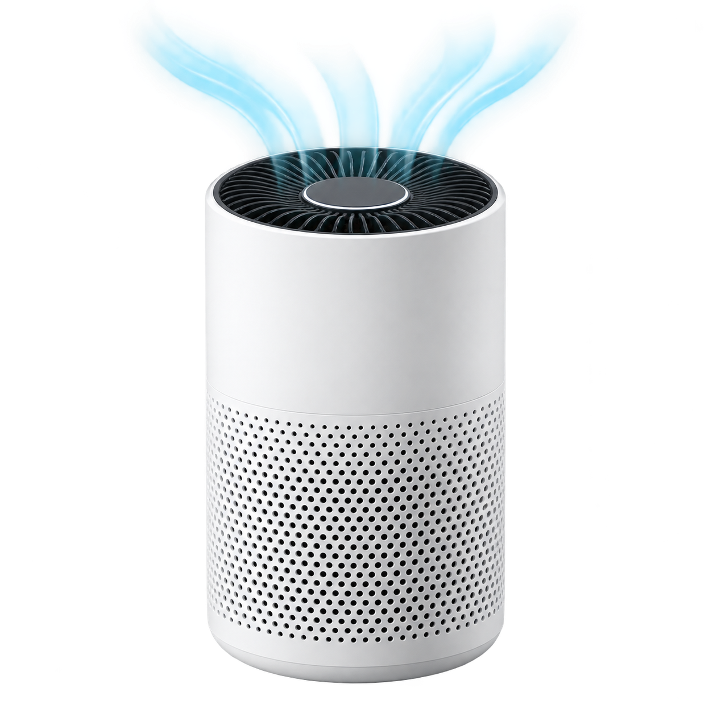

# Home Assistant - Xiaomi Mi Air Purifier 2

Local Home Assistant integration for Xiaomi Mi Air Purifier 2. It communicates directly with the purifier over the LAN by using its miIO token. No Xiaomi cloud connection is used after setup.

Product graphic generated for this open-source integration. Device details are documented on the [Xiaomi Mi Air Purifier M1 product page](https://home.miot-spec.com/s/zhimi.airpurifier.m1).

## Supported models

- `zhimi.airpurifier.m1`
- `zhimi.airpurifier.m2`
- `zhimi.airpurifier.ma1`
- `zhimi.airpurifier.ma2`

## Installation with HACS

1. Open HACS.
2. Add `https://github.com/g1n10l/Home-Assistant` as a custom integration repository.
3. Install **Home Assistant - Xiaomi Mi Air Purifier 2**.
4. Restart Home Assistant.

## Manual installation

Copy `custom_components/xiaomi_mi_air_purifier_2` to the `custom_components` directory in your Home Assistant configuration, then restart Home Assistant.

## License

[MIT](LICENSE)
